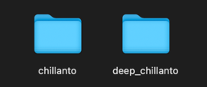
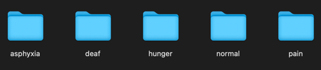
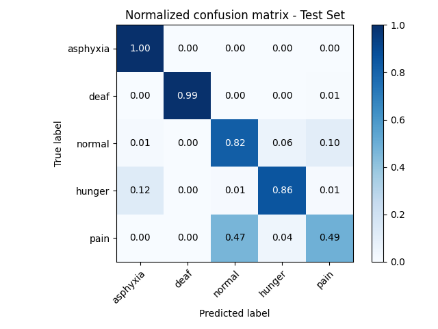

# Classification of the Baby Chillanto Data Base  

The necessary packages to run the code included in this project are listed in `requirements.txt`. 
The best option to install these packages is to create a new virtual environment with Python 3.11 
and install the packages within that environment.

```commandline
pip install -r requirements.txt
```

Before running this code, you need to have a folder named chillanto outside this directory.



The Chillanto folder must contain all the crying samples. The main classifier is programmed to classify 
5 classes, but this depends on the folders. If there are only 3 folders, then there will be 3 classes. 
If more or fewer classes are needed, organize the folders by class and delete the `chillanto_metadata.csv` 
file to generate a new one. The model I trained has these 5 classes:

* asphyxia
* deaf
* normal
* hunger
* pain

Inside this folder, there should be other folders containing the crying samples, separated by class in 
each folder.



I have included the `chillanto_metadata.csv` file to clarify any doubts regarding the folder organization.
Once the samples are ready, simply run the main.py script:

```shell
python main.py
```

After the model finishes training, two versions of the model will be saved in the `saved_models` 
folder; one in hdf5 format and the other as json and h5 files. To load the trained model and test it to 
generate a confusion matrix, run the test_model.py script:

```shell
python test_model.py
```




